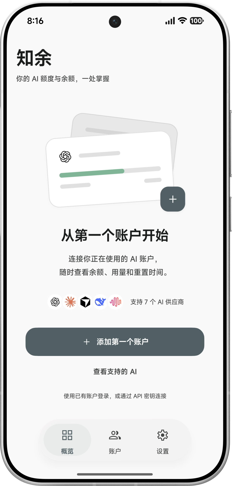
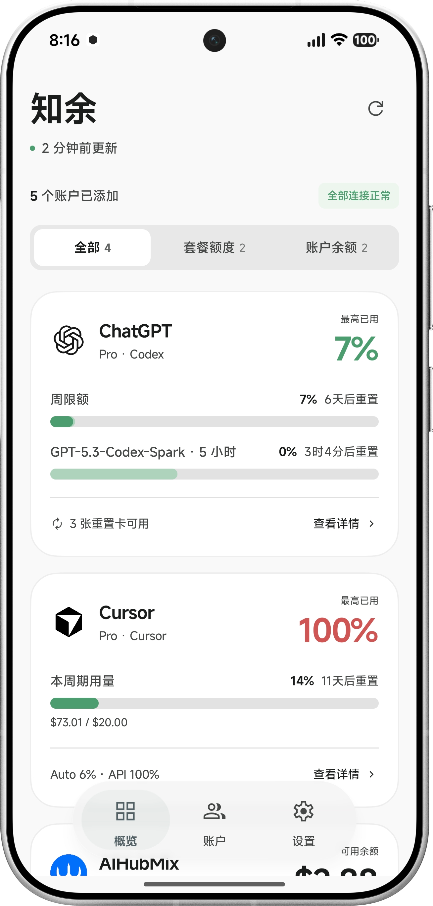
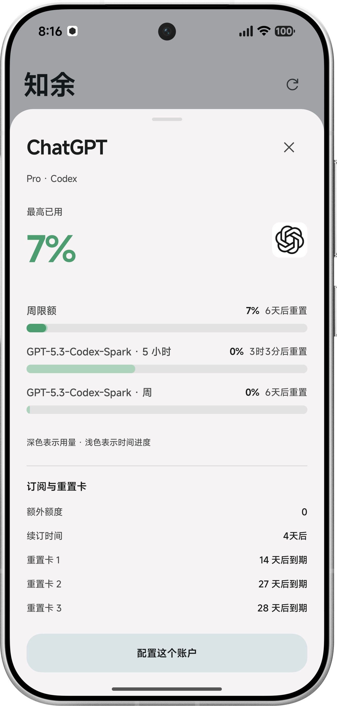
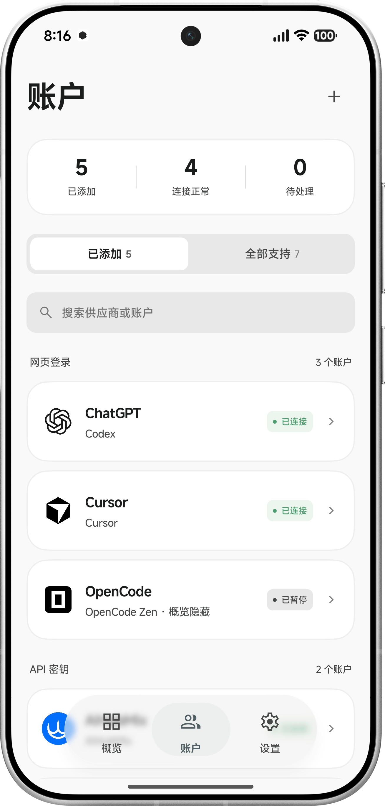
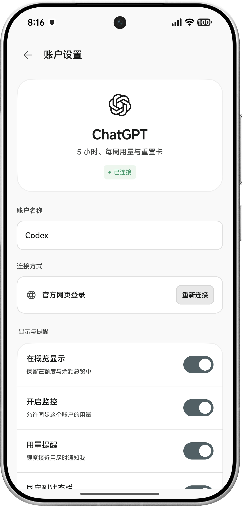

<div align="center">
  
  <h1>Zhiyu</h1>
</div>

<div align="center">

[简体中文](README.md) | English

An Android app for monitoring AI usage and account balances across multiple platforms. Track your quotas in the app, home screen widgets, and persistent notifications.

[](https://developer.android.com) [](https://kotlinlang.org) [](https://developer.android.com/jetpack/compose) [](LICENSE) [](https://github.com/Vectorking-50kg/Zhiyu/releases/latest)

</div>

<div align="center">
  
  
  
  
  
</div>

## Disclaimer

Zhiyu is an independent third-party project and is not affiliated with or endorsed by any of the supported platforms.

## Download

Get the latest APK from [GitHub Releases](https://github.com/Vectorking-50kg/Zhiyu/releases).

- **Requirements:** Android 8.0 (API 26) or later.

## Features

- **Multiple platforms and accounts:** View subscription quotas and account balances in one place, filter by account type, and compare usage against elapsed time with two overlapping progress bars.
- **Individual account controls:** Add, search, and rename accounts. Configure overview visibility, background monitoring, alerts, and persistent notifications separately for each account. Cached data is retained when monitoring is paused.
- **Notifications and home screen widgets:** Check usage without opening the app. Receive alerts when usage reaches 80% or 95%, a quota reset is detected, or a web login session expires.
- **Background refresh and error handling:** Choose a 15-, 30-, or 60-minute refresh interval. Network errors, rate limits, and expired sessions are handled separately, while the last valid data and its timestamp remain available after a failed refresh.
- **Two interface styles:** Switch between Material and Miuix, with light, dark, system, and pure-black modes, plus system dynamic colors and custom colors.
- **Local credentials and backups:** Store login credentials and API keys with encryption, and export or import account connections and settings as JSON files.

## Supported Platforms

| Platform | Connection method | Available information |
| --- | --- | --- |
| **ChatGPT** | Web login; optional device-code authorization | Codex-related five-hour and weekly limits, additional windows, Code Review, reset credits, renewal information, and extra credits |
| **Claude** | Web login; optional OAuth authorization | Five-hour and weekly limits, model-specific windows, Claude Design, and extra usage percentages |
| **Cursor** | Web login | Current billing-period usage, Auto usage, API usage, and plan information |
| **OpenCode Zen** | Web login | Account balance |
| **MiniMax** | API key for the corresponding Token Plan | Five-hour and weekly limits, unlimited-quota indicators, and quota boosts |
| **AIHubMix** | API key (token) | Account balance, cumulative spending, and total request count |
| **DeepSeek** | API key | Available balance, promotional balance, and topped-up balance |

The information displayed depends on account permissions, subscription type, and the fields returned by each platform. This table describes the data the app can currently parse; not every account provides every metric.

Some integrations depend on internal interfaces or console pages available after web login. Changes made by a platform may require an app update.

## Getting Started

1. Open the app and tap **添加第一个账户** (Add your first account). You can also add more accounts from **账户** (Accounts).
2. Choose a platform. Use web login for ChatGPT, Claude, Cursor, and OpenCode, or enter the appropriate API key for MiniMax, AIHubMix, and DeepSeek.
3. Once the login or API key is validated, return to **概览** (Overview) to view quotas and balances. Tap **查看详情** (View details) to inspect individual usage windows and reset times.
4. In **账户** (Accounts), enable monitoring, alerts, and persistent notifications as needed. Use **设置** (Settings) to adjust appearance, refresh intervals, and global notification preferences.
5. To display usage on your home screen, add the Zhiyu widget through your launcher's widget picker.

## Data and Privacy

- **Network requests:** Login, authorization, and usage queries send the necessary information to the relevant platforms and their authentication services. Zhiyu does not upload your credentials or usage data to a separate Zhiyu-operated server.
- **Local storage:** The credential store uses AndroidX Security Crypto for encryption. Preferences, usage caches, and WebView website data are managed by their respective local storage mechanisms.
- **Backups:** Exported backups are **unencrypted JSON files containing login credentials and API keys**. Keep them secure, import only from trusted sources, and do not include them in issues, screenshots, or public repositories.
- **Issue reports:** Include the Android version, app version, platform name, and steps to reproduce the problem. Remove cookies, tokens, API keys, complete authorization URLs, and any identifying account information.

## Building Locally

Android Studio with JDK 17 and Android SDK Platform 35 is recommended. The repository includes the Gradle Wrapper, so a separate Gradle installation is not required.

```bash
git clone https://github.com/Vectorking-50kg/Zhiyu.git
cd Zhiyu

# Build the debug APK
./gradlew :app:assembleDebug

# Install on a connected device with USB debugging enabled
./gradlew :app:installDebug
```

Run the development checks with:

```bash
./gradlew testDebugUnitTest :app:lintDebug
```

## Project Structure

```text
app/                  App entry point, navigation, overview, accounts, settings, and appearance
core/
  domain/             Domain models and repository interfaces
  network/            Platform APIs, parsing, OAuth, and network error handling
  storage/            Credentials, account settings, appearance preferences, and backups
  data/               Repositories, caching, background refresh, and notifications
  ui/                 Themes, icons, and shared Compose components
feature/
  auth/               WebView login and authorization screens
  widget/             Home screen widgets
```

## Feedback and Contributions

Bug reports and feature requests are welcome through [Issues](https://github.com/Vectorking-50kg/Zhiyu/issues).

## License and Acknowledgments

This project is licensed under the **[MIT License](LICENSE)**, which permits use, modification, commercial use, and redistribution, provided that the copyright and permission notices are retained.

Third-party code and assets remain subject to their original licenses. See the [licensing notes (in Chinese)](LICENSING.md) and [bundled license texts](app/src/main/assets/licenses).

Thanks to [Miuix](https://github.com/miuix-kotlin-multiplatform/miuix), [MaterialKolor](https://github.com/jordond/MaterialKolor), [Lobe Icons](https://github.com/lobehub/lobe-icons), [Material Symbols](https://github.com/google/material-design-icons), and [CodexMeter](https://github.com/KyoMio/CodexMeter).
